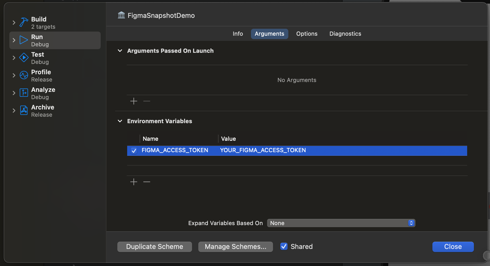

# FigmaSnapshot

A simple and lightweight library that allows you to visualise Figma design while working on your features/screens using the power of Xcode Previews.

## Installation

Add the package dependency to your Xcode project using the URL of this repository (https://github.com/rmenezes/FigmaSnapshot.git). Link your app to `FigmaSnapshot` and add the key `FIGMA_ACCESS_TOKEN` to your environment.

<p align="center">
  
</p>

## Usage

The code is very simple to use and understand. If you wish to load a Figma screen into your preview, just modify your code to include the custom modifier.


```swift
import SwiftUI
import FigmaSnapshot

struct MyView: View {
    var body: some View {
        Text("Hello World")
    }
}

#Preview {
    MyView()
        .figmaSnapshot("<Your Figma Screen here>")
}
```

## Features

- The library adds an onion skin on top of your feature and allows you to to drag to control how much of the screen you want to see.
- Persistency! Unlike other libraries, `FigmaSnapshot` restores the position of the onion skin after your view is reloaded.

<p align="center">
  
</p>
